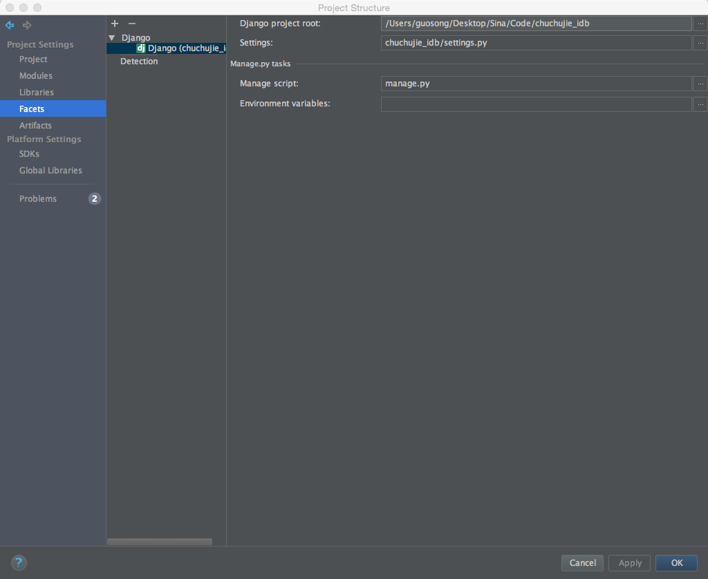
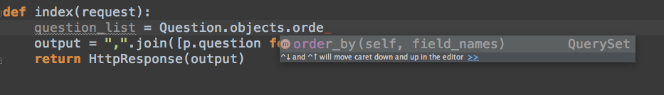

##1. Django 和IntelliJ IDEA

### 1.1 IDEA无法提示models.Model子类的所有方法
在项目中需要添加 Django模块



效果：




### 1.2  IDEA无法显示templates的tag信息以及自动补全

修改Project目录下的ProjectName.xml文件添加如下：

```
  <component name="TemplatesService">
    <option name="TEMPLATE_CONFIGURATION" value="Django" />
    <option name="TEMPLATE_FOLDERS">
      <list>
        <option value="$MODULE_DIR$/templates" />
      </list>
    </option>
  </component>
```

重启IDEA即可
